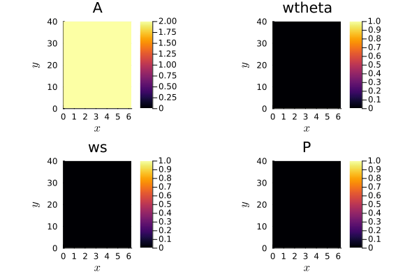

## Tutorial for the 1D model

In this section, we describe how to use **BloodFlowTrixi.jl** with **Trixi.jl**. This tutorial will guide you through setting up and running a 1D blood flow simulation, including mesh creation, boundary conditions, numerical fluxes, and visualization of results.

### Packages 
Before starting, ensure that the required packages are loaded:
```julia
using Trixi
using BloodFlowTrixi
using OrdinaryDiffEq
using Plots
```

First, we need to choose the equation that describes the blood flow dynamics:
```julia
eq = BloodFlowEquations1D(; h=0.1)
```
Here, `h` represents a parameter related to the initial condition or model scaling.

### Mesh and boundary conditions

We begin by defining a one-dimensional Tree mesh, which discretizes the spatial domain:
```julia
mesh = TreeMesh(0.0, 40.0, initial_refinement_level=6, n_cells_max=10^4, periodicity=false)
```
This generates a non-periodic mesh for the interval $[0, 40]$, with $2^{initialRefinementLevel+1}-1$ cells. The parameter `initial_refinement_level` controls the initial number of cells, while `n_cells_max` specifies the maximum number of cells allowed during mesh refinement.

In **Trixi.jl**, the Tree mesh has two labeled boundaries: **x_neg** (left boundary) and **x_pos** (right boundary). These labels are used to apply boundary conditions:
```julia
bc = (
    x_neg = boundary_condition_pressure_in,
    x_pos = Trixi.BoundaryConditionDoNothing()
)
```
- `boundary_condition_pressure_in` applies a pressure inflow condition at the left boundary.
- `Trixi.BoundaryConditionDoNothing()` specifies a "do nothing" boundary condition at the right boundary, meaning no flux is imposed.

#### Boundary condition implementation
The inflow boundary condition is defined as:
```julia
boundary_condition_pressure_in(u_inner, orientation_or_normal, direction, x, t, surface_flux_function, eq::BloodFlowEquations1D)
```
This function applies a time-dependent pressure inflow condition.

#### Parameters
- `u_inner`: State vector inside the domain near the boundary.
- `orientation_or_normal`: Normal orientation of the boundary.
- `direction`: Integer indicating the boundary direction.
- `x`: Position vector.
- `t`: Time scalar.
- `surface_flux_function`: Function to compute flux at the boundary.
- `eq`: Instance of `BloodFlowEquations1D`.

#### Returns
The boundary flux is computed based on the inflow pressure:
```math
P_{\text{in}} = \begin{cases}
2 \times 10^4 \sin^2\left(\frac{\pi t}{0.125}\right) & \text{if } t < 0.125 \\
0 & \text{otherwise}
\end{cases}
```
This time-dependent inflow pressure mimics a pulsatile flow, typical in arterial blood flow. The inflow area $A_{in}$ is determined using the inverse pressure relation, ensuring consistency with the physical model.

### Numerical flux

To compute fluxes at cell interfaces, we use a combination of conservative and non-conservative fluxes:
```julia
volume_flux = (flux_lax_friedrichs, flux_nonconservative)
surface_flux = (flux_lax_friedrichs, flux_nonconservative)
```
- `flux_lax_friedrichs` is a standard numerical flux for hyperbolic conservation laws.
- `flux_nonconservative` handles the non-conservative terms in the model, particularly those related to pressure discontinuities.

The non-conservative flux function is defined as:
```julia
flux_nonconservative(u_ll, u_rr, orientation::Integer, eq::BloodFlowEquations1D)
```

#### Parameters
- `u_ll`: Left state vector.
- `u_rr`: Right state vector.
- `orientation::Integer`: Orientation index.
- `eq`: Instance of `BloodFlowEquations1D`.

#### Returns
The function returns the non-conservative flux vector, which is essential for capturing sharp pressure changes in the simulation.

### Basis functions and Shock Capturing DG scheme

To approximate the solution, we use polynomial basis functions:
```julia
basis = LobattoLegendreBasis(2)
```
This defines a **Lobatto-Legendre** basis of polynomial degree $2$, which is commonly used in high-order methods like Discontinuous Galerkin (DG) schemes.

We then define an indicator for shock capturing, focusing on the first variable (area perturbation `a`):
```julia
id = IndicatorHennemannGassner(eq, basis; variable=first)
```
This indicator helps detect shocks or discontinuities in the solution and applies appropriate stabilization.

The solver is defined as:
```julia
vol = VolumeIntegralShockCapturingHG(id, volume_flux_dg=volume_flux, volume_flux_fv=surface_flux)
solver = DGSEM(basis, surface_flux, vol)
```
Here, `DGSEM` represents the Discontinuous Galerkin Spectral Element Method, a high-order accurate scheme suitable for hyperbolic problems.

### Semi-discretization

We are now ready to semi-discretize the problem:
```julia
semi = SemidiscretizationHyperbolic(
    mesh,
    eq,
    initial_condition_simple,
    source_terms = source_term_simple,
    solver,
    boundary_conditions=bc
)
```
This step sets up the semi-discretized form of the PDE, which will be advanced in time using an ODE solver.

#### Source term
The source term accounts for additional forces acting on the blood flow, such as friction:
```julia
source_term_simple(u, x, t, eq::BloodFlowEquations1D)
```

#### Parameters
- `u`: State vector containing area perturbation, flow rate, elasticity modulus, and reference area.
- `x`: Position vector.
- `t`: Time scalar.
- `eq::BloodFlowEquations1D`: Instance of the blood flow model.

#### Returns
The source term vector is given by:
- $s_1 = 0$ (no source for area perturbation).
- $s_2 = \frac{2 \pi k Q}{R A}$, representing frictional effects.

The friction coefficient $k$ is computed using a model-specific `friction` function, and the radius $R$ is obtained from the state vector using the `radius` function.

### Initial condition

The initial condition specifies the starting state of the simulation:
```julia
initial_condition_simple(x, t, eq::BloodFlowEquations1D; R0=2.0)
```
This function generates a simple initial condition with a uniform radius `R0`.

#### Parameters
- `x`: Position vector.
- `t`: Time scalar.
- `eq::BloodFlowEquations1D`: Instance of the blood flow model.
- `R0`: Initial radius (default: `2.0`).

#### Returns
The function returns a state vector with:
- Zero initial area perturbation.
- Zero initial flow rate.
- Constant elasticity modulus.
- Reference area $A_0 = \pi R_0^2$.

This simple initial condition is suitable for testing the model without introducing complex dynamics.

### Run the simulation

First, we discretize the problem in time:
```julia
Trixi.default_analysis_integrals(::BloodFlowEquations1D) = ()
tspan = (0.0, 0.5)
ode = semidiscretize(semi, tspan)
```
Here, `tspan` defines the time interval for the simulation.

Next, we add some callbacks to monitor the simulation:
```julia
summary_callback = SummaryCallback()
analysis_callback = AnalysisCallback(semi, interval=200)
stepsize_callback = StepsizeCallback(; cfl=0.5)
callbacks = CallbackSet(summary_callback, analysis_callback, stepsize_callback)
```
- `SummaryCallback` provides a summary of the simulation progress.
- `AnalysisCallback` computes analysis metrics at specified intervals.
- `StepsizeCallback` adjusts the time step based on the CFL condition.

Finally, we solve the problem:
```julia
dt = stepsize_callback(ode)
sol = solve(ode, SSPRK33(), dt=dt, dtmax=1e-4, dtmin=1e-11,
            save_everystep=false, saveat=0.002, callback=callbacks)
```
Here, `SSPRK33()` is a third-order Strong Stability Preserving Runge-Kutta method, suitable for hyperbolic PDEs.

### Plot the results

The results can be visualized using the following code:
```julia
@gif for i in eachindex(sol)
    a1 = sol[i][1:4:end]
    Q1 = sol[i][2:4:end]
    A01 = sol[i][4:4:end]
    A1 = A01 .+ a1
    plot(Q1 ./ A1, lw=4, color=:red, ylim=(-10, 50), label="velocity", legend=:bottomleft)
end
```
This code generates an animated GIF showing the evolution of the velocity profile over time. The velocity is computed as $Q/A$, where $Q$ is the flow rate, and $A$ is the cross-sectional area.

### Plain code
```julia
using Trixi
using BloodFlowTrixi
using OrdinaryDiffEq,Plots
eq = BloodFlowEquations1D(;h=0.1)
mesh = TreeMesh(0.0,40.0,initial_refinement_level=6,n_cells_max=10^4,periodicity=false)
bc = (
    x_neg = boundary_condition_pressure_in,
    x_pos = Trixi.BoundaryConditionDoNothing()
    )
volume_flux = (flux_lax_friedrichs,flux_nonconservative)
surface_flux = (flux_lax_friedrichs,flux_nonconservative)
basis = LobattoLegendreBasis(2)
id = IndicatorHennemannGassner(eq,basis;variable=first)
vol = VolumeIntegralShockCapturingHG(id,volume_flux_dg=volume_flux,volume_flux_fv=surface_flux)
solver = DGSEM(basis,surface_flux,vol)
semi = SemidiscretizationHyperbolic(mesh,
eq,
initial_condition_simple,
source_terms = source_term_simple,
solver,
boundary_conditions=bc)
Trixi.default_analysis_integrals(::BloodFlowEquations1D) = ()
tspan = (0.0, 0.5)
ode = semidiscretize(semi, tspan)
summary_callback = SummaryCallback()
analysis_callback = AnalysisCallback(semi, interval = 200)
stepsize_callback = StepsizeCallback(; cfl=0.5)
callbacks = CallbackSet(summary_callback,analysis_callback,stepsize_callback)
dt = stepsize_callback(ode)
sol = solve(ode, SSPRK33(), dt = dt, dtmax = 1e-4,dtmin = 1e-11,
            save_everystep = false,saveat = 0.002, callback = callbacks)

@gif for i in eachindex(sol)
    a1 = sol[i][1:4:end]
    Q1 = sol[i][2:4:end]
    A01 = sol[i][4:4:end]
    A1 = A01.+a1
    plot(Q1./A1,lw=4,color=:red,ylim=(-10,50),label="velocity",legend=:bottomleft)
end
```


## Tutorial for the 2D model

In this section, we describe how to use **BloodFlowTrixi.jl** with **Trixi.jl**. This tutorial will guide you through setting up and running a 2D blood flow simulation, including mesh creation, boundary conditions, numerical fluxes, and visualization of results.

### Packages 
Before starting, ensure that the required packages are loaded:
```julia
using Trixi
using BloodFlowTrixi
using OrdinaryDiffEq
using Plots
```

First, we need to choose the equation that describes the blood flow dynamics:
```julia
eq = BloodFlowEquations2D(; h=0.1)
```
Here, `h` represents a parameter related to the initial condition or model scaling.

### Mesh and boundary conditions

We begin by defining a two-dimensional P4est mesh, which discretizes the spatial domain:
```julia
mesh = P4estMesh(
    (2,4),
    polydeg= 2,
    coordinates_min =(0.0,0.0),
    coordinates_max = (2*pi,40.0),
    initial_refinement_level = 4,
    periodicity = (true, false)
)
```
This generates a non-periodic mesh for the domain $[0,2\pi] \times [0, 40]$, with $2\times 4\times 4^{\text{initialRefinementLevel}}$ cells. 

In **Trixi.jl**, the P4est mesh has four labeled boundaries: **x_neg** (left boundary), **x_pos** (right boundary), **y_neg** (bottom boundary), and **y_pos** (top boundary). These labels are used to apply boundary conditions:
```julia
bc = Dict(
    :y_neg =>boundary_condition_pressure_in,
    :y_pos => Trixi.BoundaryConditionDoNothing()
    )

```
- `boundary_condition_pressure_in` applies a pressure inflow condition at the bottom boundary.
- `Trixi.BoundaryConditionDoNothing()` specifies a "do nothing" boundary condition at the right boundary, meaning no flux is imposed.

#### Boundary condition implementation
The inflow boundary condition is defined as:
```julia
boundary_condition_pressure_in(u_inner, normal, x, t, surface_flux_function, eq::BloodFlowEquations2D)
```
This function applies a time-dependent pressure inflow condition.

#### Parameters
- `u_inner`: State vector inside the domain near the boundary.
- `normal`: Normal of the boundary.
- `x`: Position vector.
- `t`: Time scalar.
- `surface_flux_function`: Function to compute flux at the boundary.
- `eq`: Instance of `BloodFlowEquations2D`.

#### Returns
The boundary flux is computed based on the inflow pressure:
```math
P_{\text{in}} = \begin{cases}
2 \times 10^4 \sin^2\left(\frac{\pi t}{0.125}\right) & \text{if } t < 0.125 \\
0 & \text{otherwise}
\end{cases}
```
This time-dependent inflow pressure mimics a pulsatile flow, typical in arterial blood flow. The inflow area $A_{in}$ is determined using the inverse pressure relation, ensuring consistency with the physical model.

### Numerical flux

To compute fluxes at cell interfaces, we use a combination of conservative and non-conservative fluxes:
```julia
volume_flux = (flux_lax_friedrichs, flux_nonconservative)
surface_flux = (flux_lax_friedrichs, flux_nonconservative)
```
- `flux_lax_friedrichs` is a standard numerical flux for hyperbolic conservation laws.
- `flux_nonconservative` handles the non-conservative terms in the model, particularly those related to pressure discontinuities.

The non-conservative flux function is defined as:
```julia
flux_nonconservative(u_ll, u_rr, normal::Integer, eq::BloodFlowEquations2D)
```

#### Parameters
- `u_ll`: Left state vector.
- `u_rr`: Right state vector.
- `normal`: normal vector.
- `eq`: Instance of `BloodFlowEquations2D`.

#### Returns
The function returns the non-conservative flux vector, which is essential for capturing sharp pressure changes in the simulation.

### Basis functions and Shock Capturing DG scheme

To approximate the solution, we use polynomial basis functions:
```julia
basis = LobattoLegendreBasis(2)
```
This defines a **Lobatto-Legendre** basis of polynomial degree $2$, which is commonly used in high-order methods like Discontinuous Galerkin (DG) schemes.

We then define an indicator for shock capturing, focusing on the first variable (area perturbation `$a$`):
```julia
id = IndicatorHennemannGassner(eq, basis; variable=first)
```
This indicator helps detect shocks or discontinuities in the solution and applies appropriate stabilization.

The solver is defined as:
```julia
vol = VolumeIntegralShockCapturingHG(id, volume_flux_dg=volume_flux, volume_flux_fv=surface_flux)
solver = DGSEM(basis, surface_flux, vol)
```
Here, `DGSEM` represents the Discontinuous Galerkin Spectral Element Method, a high-order accurate scheme suitable for hyperbolic problems.

### Semi-discretization

We are now ready to semi-discretize the problem:
```julia
semi = SemidiscretizationHyperbolic(
    mesh,
    eq,
    initial_condition_simple,
    source_terms = source_term_simple,
    solver,
    boundary_conditions=bc
)
```
This step sets up the semi-discretized form of the PDE, which will be advanced in time using an ODE solver.

#### Source term
The source term accounts for additional forces acting on the blood flow, such as friction:
```julia
source_term_simple(u, x, t, eq::BloodFlowEquations2D)
```

#### Parameters
- `u`: State vector containing area perturbation, flow rate, elasticity modulus, and reference area.
- `x`: Position vector.
- `t`: Time scalar.
- `eq::BloodFlowEquations2D`: Instance of the blood flow model.

#### Returns
The source term vector is given by:
- $s_1 = 0$ (no source for area perturbation).
- $s_2 = \frac{2R}{3}\mathcal{C} \sin \theta \frac{Q_s^2}{A} + \frac{3Rk Q_{Rθ}}{A}$.
- $s_3 = -\frac{2R}{3}\mathcal{C} \sin \theta \frac{Q_s Q_{R\theta}}{A} + \frac{RkQ_{s}}{A}$.

The friction coefficient $k$ is computed using a model-specific `friction` function, and the radius $R$ is obtained from the state vector using the `radius` function. Also, the curvature $\mathcal{C}$ is computed using the `curvature` function and is equal to $1$ here.

### Initial condition

The initial condition specifies the starting state of the simulation:
```julia
initial_condition_simple(x, t, eq::BloodFlowEquations2D; R0=2.0)
```
This function generates a simple initial condition with a uniform radius `R0`.

#### Parameters
- `x`: Position vector.
- `t`: Time scalar.
- `eq::BloodFlowEquations2D`: Instance of the blood flow model.
- `R0`: Initial radius (default: `2.0`).

#### Returns
The function returns a state vector with:
- Zero initial area perturbation.
- Zero initial flow rate (in $\theta$ and $s$ directions).
- Constant elasticity modulus.
- Reference area $A_0 = \frac{R_0^2}2$.

This simple initial condition is suitable for testing the model without introducing complex dynamics.

### Run the simulation

First, we discretize the problem in time:
```julia
Trixi.default_analysis_integrals(::BloodFlowEquations2D) = ()
tspan = (0.0, 0.3)
ode = semidiscretize(semi, tspan)
```
Here, `tspan` defines the time interval for the simulation.

Next, we add some callbacks to monitor the simulation:
```julia
summary_callback = SummaryCallback()
analysis_callback = AnalysisCallback(semi, interval=200)
stepsize_callback = StepsizeCallback(; cfl=0.5)
callbacks = CallbackSet(summary_callback, analysis_callback, stepsize_callback)
```
- `SummaryCallback` provides a summary of the simulation progress.
- `AnalysisCallback` computes analysis metrics at specified intervals.
- `StepsizeCallback` adjusts the time step based on the CFL condition.

Finally, we solve the problem:
```julia
dt = stepsize_callback(ode)
sol = solve(ode, SSPRK33(), dt=dt, dtmax=1e-4, dtmin=1e-11,
            save_everystep=false, saveat=0.003, callback=callbacks)
```
Here, `SSPRK33()` is a third-order Strong Stability Preserving Runge-Kutta method, suitable for hyperbolic PDEs.

### Plot the results

The results can be visualized using the following code:
```julia
@gif for i in eachindex(sol)
pd = PlotData2D(sol[i],semi,solution_variables=cons2prim)
plt1 = Plots.plot(pd["A"],aspect_ratio=0.2)
plt2 = Plots.plot(pd["wtheta"],aspect_ratio=0.2)
plt3 = Plots.plot(pd["ws"],aspect_ratio=0.2)
plt4 = Plots.plot(pd["P"],aspect_ratio=0.2)
plot(plt1,plt2,plt3,plt4,layout=(2,2))
end
```
This code generates an animated GIF showing the evolution of the velocity profile over time. The velocity is computed as $Q/A$, where $Q$ is the flow rate, and $A$ is the cross-sectional area.

### Plain code
```julia
using Trixi
using BloodFlowTrixi
using OrdinaryDiffEq,Plots
eq = BloodFlowEquations2D(;h=0.1)
mesh = P4estMesh(
    (2,4),
    polydeg= 2,
    coordinates_min =(0.0,0.0),
    coordinates_max = (2*pi,40.0),
    initial_refinement_level = 4,
    periodicity = (true, false)
)
bc = Dict(
    :y_neg =>boundary_condition_pressure_in,
    :y_pos => Trixi.BoundaryConditionDoNothing()
    )
volume_flux = (flux_lax_friedrichs,flux_nonconservative)
surface_flux = (flux_lax_friedrichs,flux_nonconservative)
basis = LobattoLegendreBasis(2)
id = IndicatorHennemannGassner(eq,basis;variable=first)
vol =VolumeIntegralShockCapturingHG(id,volume_flux_dg = surface_flux,volume_flux_fv = volume_flux) 
solver = DGSEM(basis,surface_flux,vol)
semi = SemidiscretizationHyperbolic(mesh,
eq,
initial_condition_simple,
source_terms = source_term_simple,
solver,
boundary_conditions = bc)
Trixi.default_analysis_integrals(::BloodFlowEquations2D) = ()
tspan = (0.0, 0.3)
ode = semidiscretize(semi, tspan)
summary_callback = SummaryCallback()
analysis_callback = AliveCallback(analysis_interval=1000)
stepsize_callback = StepsizeCallback(; cfl=0.5)
callbacks = CallbackSet(summary_callback,analysis_callback,stepsize_callback)
dt = stepsize_callback(ode)
sol = solve(ode, SSPRK33(),dt=dt, dtmax = 1e-4,dtmin = 1e-12,save_everystep = false,saveat = 0.003, callback = callbacks)
@gif for i in eachindex(sol)
pd = PlotData2D(sol[i],semi,solution_variables=cons2prim)
plt1 = Plots.plot(pd["A"],aspect_ratio=0.2)
plt2 = Plots.plot(pd["wtheta"],aspect_ratio=0.2)
plt3 = Plots.plot(pd["ws"],aspect_ratio=0.2)
plt4 = Plots.plot(pd["P"],aspect_ratio=0.2)
plot(plt1,plt2,plt3,plt4,layout=(2,2))
end
```



## Reconstruction of 3D datas

In this section, we describe how to reconstruct **3D data** from 1D and 2D blood flow simulations using **BloodFlowTrixi.jl**. This allows us to visualize the reconstructed vessel in a three-dimensional space and export the data for further analysis.

---

### Overview

The reconstruction functions take the simulation results from **1D** and **2D** blood flow models and generate **3D representations**. These representations are computed based on:
- The spatial position of the computational grid points.
- The computed area perturbation and reference area, used to determine the local vessel radius.
- Flow velocity components projected onto the 3D geometry.
- Pressure variations along the vessel.

The output can be stored in **VTK format**, which allows for visualization with **ParaView** or similar tools.

---

### Reconstruction from 1D Model

For the **1D case**, we assume the vessel follows a straight or predefined curve in 3D space. The reconstructed shape is obtained by rotating the cross-sectional area around a centerline.

#### Example Usage

```julia
out = "datas/"
if isdir(out)
    rm(out, recursive=true)  
    mkdir(out)  
end

for i in eachindex(sol)
    datas = get3DData(eq, semi, sol, i, vtk=true, out=out)
end
```

This script reconstructs the 3D vessel for each time step of the solution and saves the results in **VTK format**.

---

### Reconstruction from 2D Model

For the **2D case**, the vessel can follow a more complex curved path. The reconstruction uses:
- **A centerline function** `curve(s)`, which gives the position of the vessel as a function of the axial coordinate.
- **A normal vector function** `nor(s)`, which defines the local orientation of the vessel.
- **A binormal function** to complete the 3D frame.
- **A radius function**, which computes the local vessel radius from the area values.

#### Example Usage

```julia
out = "datas/"
if isdir(out)
    rm(out, recursive=true)  
    mkdir(out)  
end

curve(s) = SA[s/40, cospi(s/40), sinpi(s/40)] / sqrt(1/40^2 + (pi/40)^2)
tanj(s) = SA[1/40, -pi/40*sinpi(s/40), pi/40*cospi(s/40)] / sqrt(1/40^2 + (pi/40)^2)
nor(s) = SA[0, -cospi(s/40), -sinpi(s/40)]

for i in eachindex(sol)
    datas = get3DData(eq, curve, tanj, nor, semi, sol, i, vtk=true, out=out)
end
```

This script reconstructs the 3D vessel geometry using a predefined **curved centerline** and associated **tangent, normal, and binormal vectors**.

---

### Visualization

Once the VTK files are generated, you can open them in **ParaView**:
1. Open **ParaView**.
2. Click **File > Open**, navigate to your `datas/` folder, and select a `.vtu` file.
3. Click **Apply** to visualize the reconstructed 3D vessel.

You can apply filters like **Clip**, **Slice**, and **Glyph** to inspect different regions of the simulation.

---

### Summary

- **1D reconstruction** assumes a straight centerline and rotates the cross-section to create a 3D vessel.
- **2D reconstruction** follows a predefined curved centerline with tangent and normal vectors.
- **VTK output** enables advanced visualization using **ParaView** or similar tools.